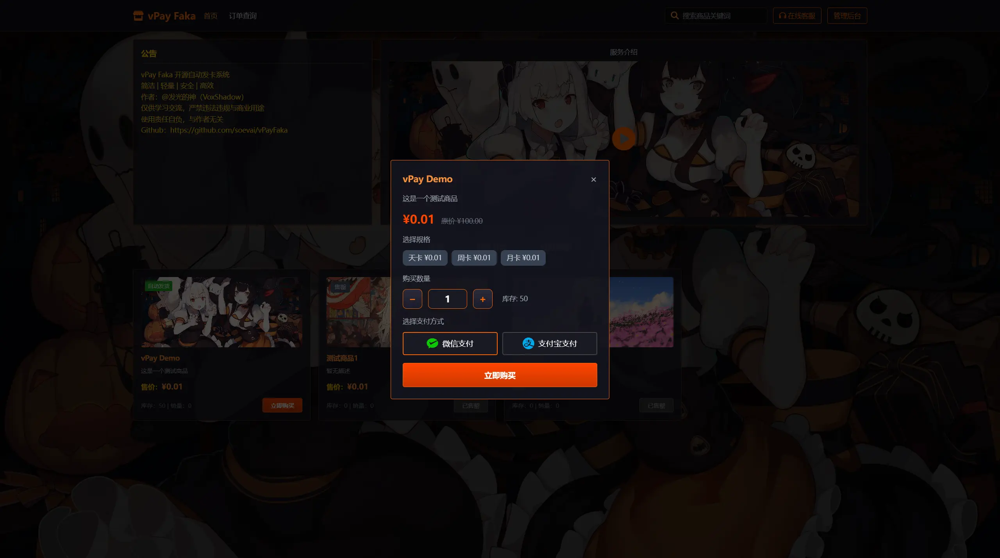
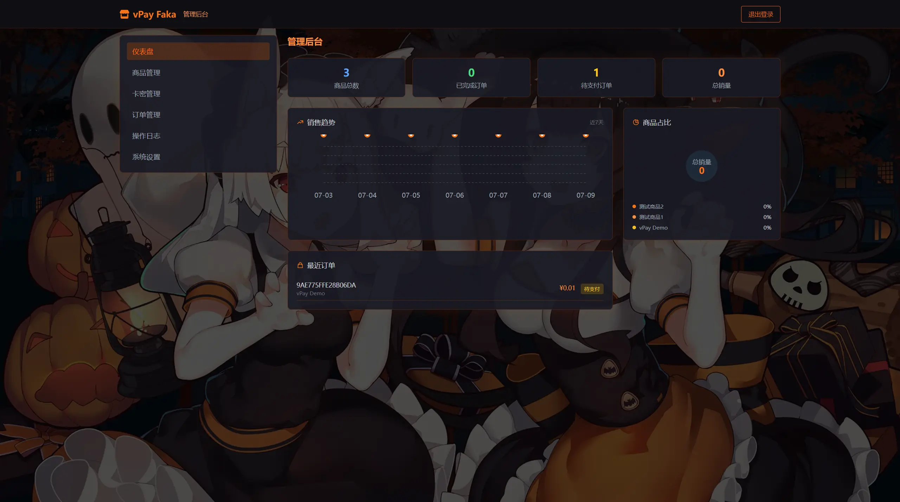
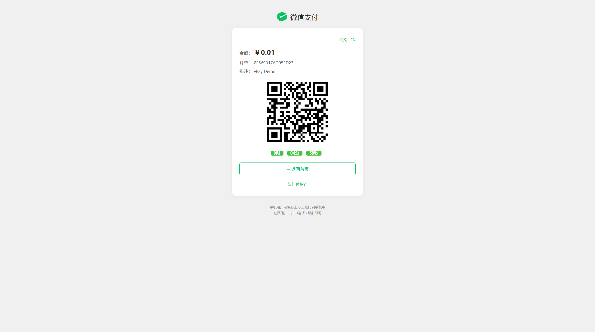

# vPay Faka

一个跑在 PHP 7.0 + MySQL 5.7 上的虚拟商品自动发卡系统。对接 V免签，扫码付款，自动发货。没有 composer，没有 npm，没有 CDN — 传上去就能跑。

     

## 功能

- 🛒 商品管理 — 支持商品分类、多规格 (SKU)、库存自动统计
- ⚡ 自动发卡 — 支付成功后从事务锁定的卡密池中提取，杜绝超卖
- 💰 V免签支付 — 对接 V免签支付网关，支持微信/支付宝扫码收款
- 📧 邮件通知 — 支付完成后自动发送卡密到用户邮箱（SMTP / 自定义 API）
- 📊 管理后台 — 仪表盘、商品/卡密/订单管理、系统设置，含销售趋势图表
- 🔍 订单查询 — 按商户订单号或邮箱查询订单详情
- ⏱️ 超时取消 — 超时未支付订单自动取消并返还库存
- 🔒 安全防护 — CSRF 令牌、bcrypt 密码哈希、CSP 策略、防重放、行锁防超卖
- 🪄 一键安装 — 访问网站自动检测并引导安装，无需手动导入 SQL
- 📝 操作日志 — 管理员操作全程记录，支持审计追溯
- 📦 零外部依赖 — 无 CDN 依赖，静态资源全部本地化

## 预览

### 前台首页


### 扫码支付



### 管理后台



### 收款弹窗



## 为什么写一个发卡系统

市面上发卡系统不少，但要么依赖拉满（composer + node + redis），要么安全问题一塌糊涂。这个项目的目标是：**把该做的安全做到位，同时保持部署成本为零**。

核心逻辑全部塞在一个 `functions.php` 里，不拆几十个文件装架构。不用 composer，PHPMailer 直接 vendor 进来。不用 CDN，Tailwind / Font Awesome / jQuery 全部本地化。安装向导自动建库建表写配置。支付回调的签名校验、Nonce 防重放、行级锁防超卖 — 该有的都有。bcrypt 存密码，CSRF 令牌用 `hash_equals` 常量时间比对，会话定期 regenerate。

如果你只是想快速搭个发卡站卖点卡密，又不想在安全上裸奔，这个可能适合你。

## 跑起来

### 1. 数据库配置

两种方式，任选其一：

环境变量（推荐生产用）：
```bash
export VPAY_DB_HOST=127.0.0.1
export VPAY_DB_PORT=3306
export VPAY_DB_NAME=vpay
export VPAY_DB_USER=vpay
export VPAY_DB_PASS=your_secure_password
export VPAY_BASE_URL=https://your-domain.com
```

或者 `.env` 文件：
```bash
cp .env.example .env
# 编辑 .env 填入实际值
```

> 默认密码 `vpay@2085` 仅方便本地开发。生产环境请用环境变量覆盖。

### 2. 上传

文件扔到网站根目录。确保 `data/` 目录可写。

### 3. 访问

打开网站地址。系统检测到未安装会自动跳到安装向导，建库建表写配置一气呵成。装完自动生成 `data/installed.lock`，下次访问直接进首页。

### 4. 登录后台

- 地址：`http://你的域名/admin/`
- 账号：`admin`
- 密码：`123456`

> 登录之后第一件事：去后台 → 系统设置 → 登录设置，把密码改了。

### 5. 对接支付

部署 [V免签](https://github.com/soevai/vmq) 监控端，然后在后台填上 V免签地址和通讯密钥。邮件通知可选配（SMTP 或自定义 API）。

## 项目结构

```
vpay/
├── admin/                    # 管理后台
│   ├── index.php             # 仪表盘 SPA
│   ├── login.php             # 登录
│   └── logout.php            # 登出
├── assets/                   # 静态资源（全部本地化，无 CDN 依赖）
│   ├── css/tailwind.min.css
│   ├── fontawesome/          # Font Awesome 6
│   └── js/jquery.min.js
├── config/
│   ├── database.php          # 数据库配置（支持 .env 覆盖）
│   └── defaults.php          # 系统默认值
├── PHPMailer/PHPMailer/      # PHPMailer（无需 composer）
├── templates/
│   ├── header.php / footer.php
│   ├── style.css
│   ├── image/                # bg.jpg, favicon.ico
│   ├── video/video.mp4
│   └── mail/order_notify.html
├── images/                   # README 截图
├── cron.php                  # 定时任务入口（静态密钥认证）
├── .env.example
├── .gitignore
├── LICENSE                   # MIT
├── api.php                   # API 路由（26 个 action）
├── config.php                # 配置加载器
├── functions.php             # 全部业务逻辑
├── index.php                 # 前台首页 SPA
├── install.php               # 一键安装
├── notify.php                # 支付异步回调
├── order.php                 # 订单查询
├── pay.php                   # 扫码支付页
├── return.php                # 支付同步跳转
├── send_mail.php             # 邮件发送（HMAC-SHA256 签名）
└── README.md
```

## 数据库

| 表 | 说明 |
|----|------|
| `products` | 商品，SKU 用 JSON 存 |
| `orders`  | 订单，卡密发放后写入 cards 字段 |
| `cards`   | 卡密池，发卡时事务锁定防超卖 |
| `site_config` | 系统配置，key-value |
| `admin_logs`  | 管理员操作日志 |

## API 一览

### 前台（无需登录）

| Action | 方法 | 说明 |
|--------|------|------|
| `getProducts` | GET | 商品列表，含实时库存 |
| `getCategories` | GET | 分类列表 |
| `getProductById` | GET | 单个商品详情 |
| `getSiteConfig` | GET | 站点配置 |
| `getCardsGroupBySku` | GET | 按 SKU 分组统计卡密库存 |
| `createOrder` | POST | 创建订单（需 CSRF） |
| `getOrder` | GET | 按 orderId / payId 查订单 |
| `checkOrder` | GET | 检查支付状态并发货 |
| `searchOrdersByAccount` | GET | 按邮箱查订单（频率限制） |

### 后台（需管理员登录 + CSRF）

| Action | 说明 |
|--------|------|
| `getDashboard` | 仪表盘数据 |
| `getAdminConfig` / `updateSiteConfig` / `resetConfig` | 系统设置 |
| `addProduct` / `editProduct` / `deleteProduct` | 商品管理 |
| `getCards` / `addCards` / `batchDeleteCards` | 卡密管理 |
| `getOrders` / `completeOrder` / `cancelTimeoutOrders` | 订单管理 |
| `getAdminLogs` | 操作日志 |
| `testTakeCard` / `reissueCards` / `resetStock` | 运维工具 |

## 支付流程

```
用户选商品 → 填邮箱 → 选微信/支付宝 → 创建订单
    │
    ▼
跳转 pay.php（二维码 + 倒计时 + 前端轮询）
    │
    ▼
扫码支付 → V免签监控端检测到账 → POST notify.php
    │
    ▼
notify.php: 验签名 + 时间戳防重放(300s) + Nonce 去重
    │
    ▼
SELECT ... FOR UPDATE 事务锁卡密 → 发放 → 更新订单 → 发邮件
    │
    ▼
用户看到卡密 / 邮箱收到卡密
```

## SKU 多规格

商品最多 4 个规格，各自定价，卡密按规格独立管理：

```json
[
  {"name": "月卡", "price": 19.90},
  {"name": "季卡", "price": 49.90},
  {"name": "年卡", "price": 149.90}
]
```

## 订单状态

| 状态 | 含义 |
|------|------|
| `pending` | 等付款 |
| `completed` | 付了，卡密已发 |
| `cancelled` | 超时取消，库存已还 |
| `failed` | 出问题了（缺卡、签名不对等） |

## 邮件配置

两种方式：

**SMTP 直发** — 后台填 SMTP 信息即可。QQ 邮箱记得用授权码不是登录密码。

**自定义 API** — 配好 API 地址和密钥，系统带 HMAC-SHA256 签名 POST 过来：

```
POST <mail_apiUrl>
X-Timestamp: 1234567890
X-Nonce: <random_hex>
X-Signature: <HMAC-SHA256(timestamp.nonce.body, secret)>
Content-Type: application/json

{"msg": "<html>", "isHtml": true, "to": "user@example.com"}
```

## 安全措施

没有花活，都是该做的：

| 场景 | 做法 |
|------|------|
| 密码 | bcrypt（`password_hash` / `password_verify`） |
| CSRF | `random_bytes(32)` 令牌，`hash_equals` 常量时间比对 |
| SQL 注入 | 全 PDO 预处理 + 参数绑定 |
| XSS | 服务端 `htmlspecialchars()`，前端 `textContent` |
| Session | HttpOnly + SameSite=Lax + HTTPS Secure + `session_regenerate_id` |
| 并发超卖 | `SELECT ... FOR UPDATE` 行级锁 + 事务 |
| 回调伪造 | MD5 签名 + 时间戳(300s) + Nonce 文件缓存去重 |
| 邮件接口 | HMAC-SHA256 + 时间戳(120s) + Nonce |
| 暴力破解 | 5 次失败锁 3 分钟 |
| 频率限制 | 购买: 每 IP 每小时 5 次；查询: 每 IP 每分钟 3 次 |
| HTTP 头 | X-Frame-Options: DENY / X-Content-Type-Options / Referrer-Policy / CSP |
| 安装保护 | `data/installed.lock` + 重装需验证管理员密码 |

## 定时任务

```bash
# 每分钟检查并取消超时订单
# 密钥可通过环境变量 VPAY_CRON_SECRET 或在后台配置
* * * * * curl -s "http://你的域名/cron.php?secret=你的密钥"
```

## 部署检查清单

上线前逐项确认：

- [ ] 数据库密码已改（不是 `vpay@2085`）
- [ ] 管理员密码已改（不是 `123456`）
- [ ] V免签密钥已配，两边一致
- [ ] `notify.php` 能被监控端访问到
- [ ] `data/` 目录可写
- [ ] HTTPS 环境下 `ssl_verify` 建议开启
- [ ] 建议设置 `admin_access_key` 后台安全码
- [ ] 需要邮件通知的话配好 SMTP

## 常见问题

**安装完白屏？** 检查 PHP 版本 >= 7.0，确认 PDO、cURL、OpenSSL 扩展都开了。

**付了钱没发货？** 依次排查：V免签监控端是否在跑 → 支付密钥是否一致 → `notify.php` 能否被监控端访问（防火墙/安全组）→ PHP 错误日志。

**邮件发不出去？** QQ 邮箱用授权码不是密码。确认服务器能对外连 SMTP 端口 465。

**怎么重装？** 删掉 `data/installed.lock`，访问 `install.php?force=reinstall`，输入当前管理员密码。会清空所有数据重新来。

## 免责声明

本软件开源，仅供学习和研究。

- 禁止用于任何违法违规用途（销售盗版卡密、洗钱、诈骗、赌博等）
- 对接支付接口前确保你具备合法资质
- 你卖什么东西你自己负责
- 作者不参与任何使用者的商业活动，不承担任何连带责任
- 部署前自己审查代码，根据当地法规调整

不同意以上条款就别用。

## 许可证

MIT License · Copyright (c) 2026 [VoxShadow (发光的神)](https://github.com/soevai)
